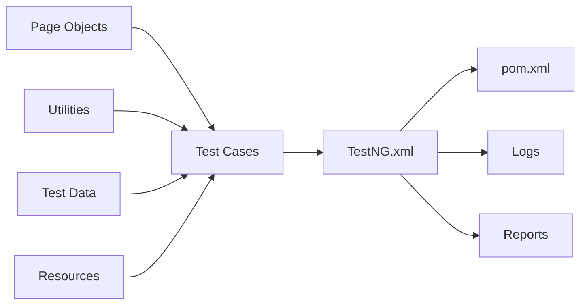

# OpenCart Test Automation Project
#### Project Overview: 

The purpose of this project is to automate the test scenarios of OpenCart web application. The goal is to create efficient test scripts which covers the vital functionalitites of the application. This project is created using Hybrid Automation Framework i.e. ***Java, Selenium, TestNG, Maven & Page Object Model***.

---
#### Project Structure:

- **Page Objects:** This package contains classes which has the web elements of the pages of web application like *BasePage, HomePage, RegistrationPage, LoginPage, MyAccountPage*.
- **Utilities:** This package contains utility files like *ExcelUtility, DataProviders, ExtentReportManager* which are used by the test classes.
- **Test Data:** This directory contains an excel file which provides test data.
- **Resources:** This directory contains resource files like *config.properties, log4j2.xml*.
- **Test Cases:** This package contains test scripts for each page of web application. These are *BaseClass, TC_001_AccountRegistrationTest, TC_002_LoginTest, TC_003_LoginDDT*.
- **TestNG.xml:** This file is used to execute test scripts. Some specific xml files are also created for specific purpose like *mastersuite.xml* for executing all test scripts, *grouping.xml* to execute a group of test scripts.
- **pom.xml:** This file is used to download dependencies and plugins as follows:
	- Selenium Java, version 4.16
	- Apache POI, version 5.25
	- Log4j, version 2.22.1
	- TestNG, version 7.9.0
- **Logs:** This directory contains information about executed test scripts like info, debug, warnings, etc.
- **Reports:** This directory contains reports from testNG files and extent reports.
---
#### Test Scenarios:
- Validation of Account Registration Page
- Validation of Login Page
---
For questions or issues, contact:

-   Project Maintainer: Soumesh Bhaumik
-   Technical Support: soumeshbhaumik99@gmail.com
